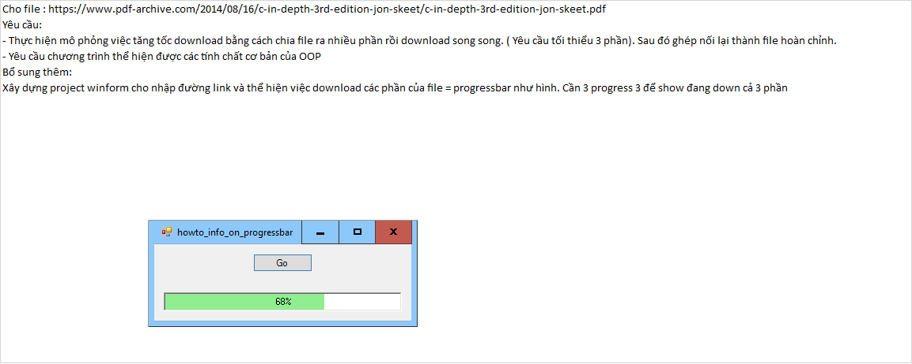

Git workflow atlassian: https://www.atlassian.com/git/tutorials/comparing-workflows/gitflow-workflow
```bash
$ git checkout develop
$ git checkout -b feature-{your_name}
$ git add .
$ git commit -m "your message"
$ git push origin feature-{your_name}

create merge request in gitlab
```
# Exercises
Write the program as follows:
 
 

